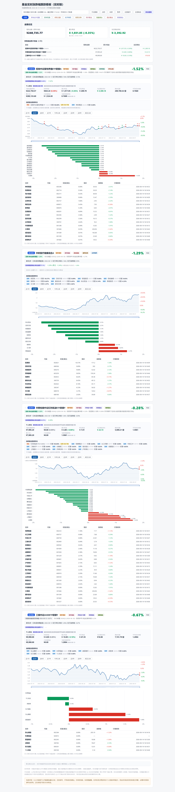
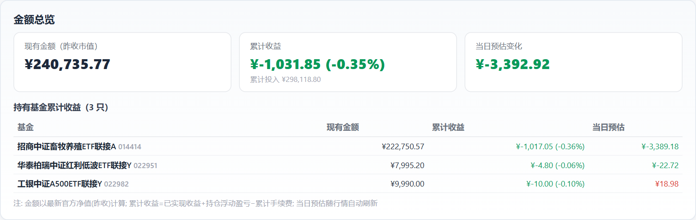
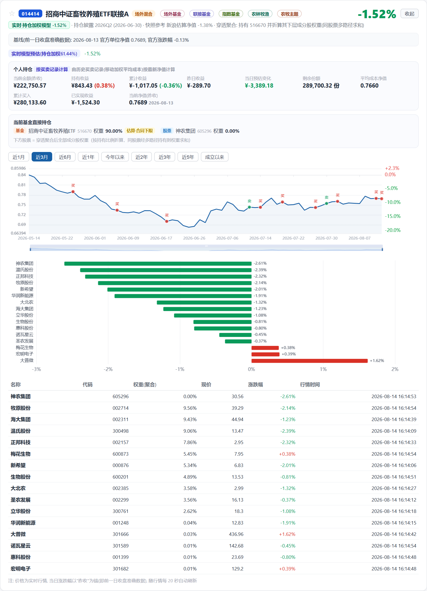
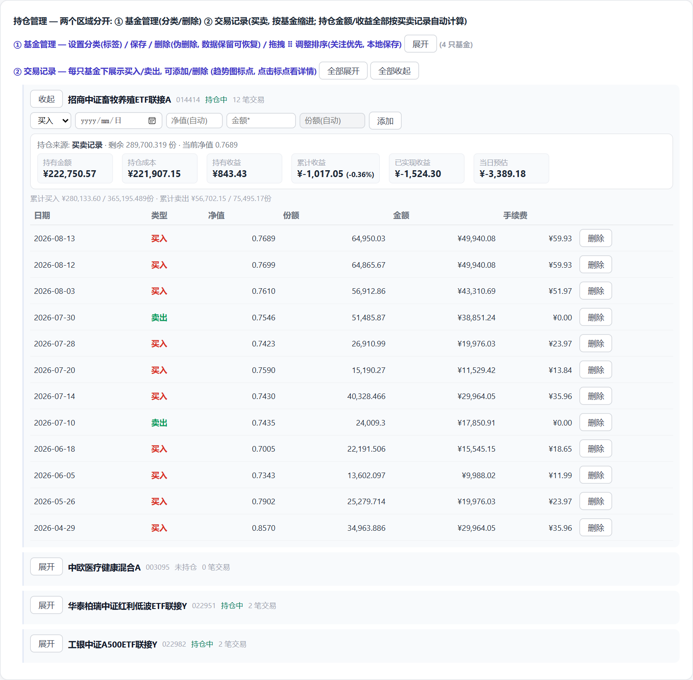

# 基金实时涨跌幅跟踪看板

本地运行的个人基金跟踪工具：实时行情、持仓加权预估、净值历史曲线、个人持仓收益、金额总览。所有数据统一存储在 SQLite 数据库中，纯 Python 标准库实现，无第三方依赖。

---

## 目录

1. [功能总览](#1-功能总览)
2. [快速开始](#2-快速开始)
3. [页面功能与操作指南](#3-页面功能与操作指南)
4. [命令行操作](#4-命令行操作)
5. [数据存储架构](#5-数据存储架构)
6. [移植与部署](#6-移植与部署)
7. [常见问题 FAQ](#7-常见问题-faq)
8. [免责声明](#8-免责声明)

---

## 1. 功能总览

| 功能模块 | 说明 |
|---|---|
| **实时行情** | 页面自动轮询公开行情接口（主通道 + 备通道自动切换），显示每只基金及持仓股票的现价、涨跌幅、行情时间 |
| **金额总览** | 页面顶部汇总：现有金额（市值）、累计收益、当日预估变化、各持有基金明细 |
| **基金卡片** | 每只基金一张卡片：基线、持仓加权模型预估、实时涨跌、净值曲线、持仓柱状图、持仓股票表格 |
| **净值历史曲线** | 9 个时间区间（1月/3月/6月/1年/今年以来/2年/3年/5年/成立以来），支持缩放，买卖标点标注 |
| **持仓加权预估** | 根据披露持仓权重 × 个股实时涨跌幅加权计算基金当日预估 |
| **个人持仓收益** | 按买卖记录（移动加权平均成本法）计算：当前金额、持有收益、累计收益、昨日收益 |
| **关注星标** | 关注优先排在前面（本地持久化） |
| **拖拽排序** | 持仓管理面板中拖拽调整基金顺序 |
| **标签筛选** | 按分类（ETF/场外/联接/养老金等）快速筛选基金 |
| **持仓管理** | 添加/修改/删除（伪删除可恢复）/恢复基金，设置分类标签 |
| **交易记录** | 添加/删除买入卖出记录，自动计算持仓与收益 |
| **数据同步** | 每日自动锁定官方基线，页面打开时自动检查并补数据 |
| **手续费计算** | 买入按基金申购费率（可配置）自动算手续费；卖出手续费可手填（默认按赎回费率）。累计收益已扣除手续费，对齐支付宝口径 |
| **标签自动获取** | 添加基金时自动从公开接口拉取真实元数据（名称/类型/主题标签/最新净值/申购费率），并与内置标签库合并，无需手动分类 |
| **联接基金穿透** | 联接基金会自动识别并穿透到底层 ETF（如 014414 → 畜牧养殖 ETF 516670），展示底层持仓与加权预估 |
| **金额悬浮说明** | 看板中所有金额/收益指标均带鼠标悬浮气泡，解释该数值的计算口径与含义 |
| **交易表单优化** | 添加交易支持日期组件（自动带出当日历史净值）、金额/份额联动自动计算、手续费自动填充 |
| **猪周期数据看板** | 独立模块（`/pigcycle`）：三指标物理隔离追踪——能繁母猪存栏量（带来源文章名+链接）、仔猪/生猪价格（自动接入农业农村部周度监测）、冻品库存（手动/CSV）；不做复杂信号推演 |

---

## 2. 快速开始

### 环境要求

- **Python 3.12+**（仅标准库，无需 pip 安装任何第三方包）
- Windows / macOS / Linux 均可

### 启动

```bash
# 方式一：双击（Windows）
start_server.bat

# 方式二：命令行
python live_server.py 8123
```

- `start_server.bat` 为**菜单式启停脚本**：运行后输入 `1` 启动服务、输入 `2` 关闭服务（按 PID 精确结束进程，避免无法找到进程的问题）。
- 启动后浏览器访问 **http://127.0.0.1:8123**。

> 首次启动会自动初始化数据库（表结构自动创建）、迁移配置、生成看板页面，无需手动操作。

### 关闭

- `start_server.bat` 方式：菜单输入 `2` 关闭，或直接关闭弹出的窗口
- 命令行方式：`Ctrl + C`

---

## 3. 页面功能与操作指南

页面从上到下依次为：状态栏 → 金额总览 → 标签筛选栏 → 基金卡片列表 → 持仓管理。


*图 1：看板整体效果（页面顶部为金额总览与筛选栏，下方为各基金卡片）*

### 3.1 状态栏

位于页面顶部，显示：
- 行情通道状态（实时行情 / 实时行情(备)）
- 自动刷新间隔（20 秒/60 秒可选）
- 最近更新时间
- 市场状态（盘中/休市）

**手动刷新**：点击"手动刷新"按钮立即拉取一次最新行情。
**自动刷新**：点击"20秒"或"60秒"按钮开启定时轮询。

### 3.2 金额总览

页面最顶部的汇总卡片，聚合所有**已配置持仓**的基金：

| 指标 | 说明 |
|---|---|
| 现有金额（昨收市值） | 各持仓基金市值合计（剩余份额 × 最新官方净值） |
| 累计收益 | 已实现收益 + 持仓浮动盈亏 − 累计手续费（含收益率%） |
| 当日预估变化 | 今日实时预估变动，随行情自动刷新 |

**明细表**：下方列出每只持有基金的现有金额、累计收益、当日预估。
**点击明细行** → 自动滚动定位到对应基金卡片并高亮。

> 所有金额/收益指标均带**鼠标悬浮气泡**（鼠标移上去显示），解释该数值的计算口径。例如"累计收益 = 已实现收益 + 持仓浮动盈亏 − 累计手续费"，与支付宝"持有收益/累计收益"口径一致。


*图 2：金额总览卡片 — 现有金额、累计收益、当日预估变化及持有基金明细*

> 未持仓（金额为 0）的基金不计入总览。配置方法见 [3.6 持仓管理](#36-持仓管理) 或 [3.7 交易记录](#37-交易记录)。

### 3.3 基金卡片

每只跟踪基金一张卡片，自上而下包含：


*图 3：基金卡片示例 — 头部行情、净值历史曲线、持仓构成柱状图、持仓股票表格*

#### ① 卡片头部
- **★/☆ 关注按钮**：点击关注，该基金优先排在所有卡片最前面（刷新后保留）
- 基金名称、代码、类型徽标（场内ETF / 场外混合）、标签
- 右侧：基金当日涨跌幅 + "收起/展开"按钮

#### ② 信息区
- **快照参考**：基金本身实时口径（场内价 / 跟踪锚 / 持仓加权模型 / 最近官方净值）
- **基线**：前一日收盘准确数据（官方单位净值 + 官方涨跌幅），作为当日涨跌锚点
- **实时模型预估**：持仓加权涨跌幅（披露覆盖 X%），未披露余量以行业指数近似

#### ③ 个人持仓区
展示（按买卖记录计算或手动配置）：
- 当前金额（昨收）、持有收益（+收益率）、累计收益（+收益率）
- 昨日收益、当日预估变化
- 剩余份额、平均成本净值、累计买入、已实现收益、当前净值

#### ④ 净值历史曲线（趋势图）
- **时间区间 Tab**：近1月 / 近3月 / 近6月 / 近1年 / 今年以来 / 近2年 / 近3年 / 近5年 / 成立以来，点击即切换
- **缩放**：图表下方滑块或鼠标滚轮缩放
- **买卖标点**：红色圆点 = 买入，绿色圆点 = 卖出（仅显示在当前区间内的交易）

#### ⑤ 持仓构成柱状图
按当日涨跌幅排序的基金持仓股票柱状图（红涨绿跌）。

#### ⑥ 持仓股票表格
每行一只股票：名称、代码、权重、**现价、涨跌幅、行情时间**（随行情自动刷新，约每 20 秒更新一次）。

### 3.4 标签筛选

页面中部的一排标签按钮（"全部 / ETF / 场外基金 / 联接基金 / 指数基金 / 养老金Y份额"...）：
- 点击标签 → 只显示带该标签的基金，顶部提示"当前筛选: X · 共 N 只, 显示 M 只"
- 点击"显示全部"恢复
- 标签由 [3.6 持仓管理](#36-持仓管理) 中每只基金的"分类"字段控制

### 3.5 关注与排序

- **关注**：点击卡片头部 ☆ 变为 ★（橙色），该基金移到最前
- **手动排序**：进入持仓管理面板，拖拽每行左侧的 **⠿** 手柄调整顺序，松手即保存并同步到主看板

> 关注与排序保存在浏览器本地（localStorage），换浏览器/清缓存会重置。

### 3.6 持仓管理

点击页面底部"持仓管理"按钮打开管理卡片，分两个区域：


*图 4：持仓管理面板 — 基金管理列表与交易记录入口（展开后可查看已删除基金区与买卖记录）*

**① 基金管理**
- 每行：**⠿ 拖拽手柄**、基金名称+代码、分类标签输入框（逗号分隔）、**申购费率%** 输入框、[保存]、[删除]
- **申购费率%**：基金的买入申购费率（添加时自动从公开接口拉取 1 折后费率，如 014414=0.12%）。买入交易按此费率自动算手续费，可手动修改
- **保存**：修改分类标签 / 申购费率后保存
- **删除**：伪删除（先点一次变"确认删除?"，再点一次确认）。基金从看板消失，数据保留
- **已删除基金区**：列出所有已删除基金，点 [恢复] 一键找回（自动补数据到最新）
- **添加基金**：输入 6 位基金代码（可选名称）→ [添加基金]。添加时自动拉取真实元数据（名称/类型/主题标签/最新净值/申购费率），联接基金自动识别并穿透到底层 ETF 锚

**② 交易记录**
- 按基金分组，每组显示：累计买入/卖出/剩余份额、**持仓来源**、交易明细表（含**手续费**列）
- 每组可添加交易，字段联动如下：
  - **类型**：买入 / 卖出
    - 买入：填**金额**自动算份额；手续费按基金申购费率自动算（不显示输入框，可手改）
    - 卖出：填**份额**自动算金额；手续费输入框显示，默认按赎回费率自动算（可手改，默认 0）
  - **日期**：日期组件，选择后**自动带出该日历史净值**（可手改）
  - **净值**：选择日期后自动填充，也可手填
  - **金额 / 份额**：二者联动，填其一自动算另一（当前框只读自动算，聚焦可手改）
- 交易记录删除：点击行内 [删除]
- 已填/自动算的手续费会计入该基金历史并参与**累计收益**扣减

### 3.7 常见操作示例

| 我想... | 操作 |
|---|---|
| 添加一只基金 | 持仓管理 → ① → 输入代码 → 添加基金（自动拉取元数据+标签） |
| 设置持仓金额 | 持仓管理 → ① → 修改分类旁...（推荐用下方交易记录添加买入） |
| 记录一笔买入 | 持仓管理 → ② → 选基金 → 类型=买入 → 选日期(自动带净值) → 填金额(自动算份额) → 添加 |
| 记录一笔卖出 | 持仓管理 → ② → 选基金 → 类型=卖出 → 选日期 → 填份额(自动算金额) → 添加（手续费默认按赎回费率） |
| 修改申购费率 | 持仓管理 → ① → 申购费率% 输入框 → 保存 |
| 关注某基金 | 卡片头部点 ☆ |
| 查看长期走势 | 卡片趋势图点"近3年/成立以来" |
| 删除某基金 | 持仓管理 → ① → 删除 → 确认删除 |
| 恢复误删基金 | 持仓管理 → ① → 已删除基金区 → 恢复 |
| 筛选只看 ETF | 顶部标签点"ETF" |
| 看金额含义 | 鼠标悬停在任何金额/收益数字上 |

### 3.8 猪周期数据看板（独立模块）

独立页面 `/pigcycle`（与基金看板物理隔离，使用独立数据库 `data/pigcycle.db`）。聚焦**三指标隔离追踪**，不做复杂信号推演：

- **能繁母猪存栏量**（万头，季度绝对量）：决定 10 个月后生猪供给，是最根本的产能领先指标。精确存栏量每季度末（3/6/9/12 月）经国新办 / 统计局发布。每条数据可带**来源文章名 + 快捷链接**（如「国新办2026年上半年发布会」），页面信号卡与数据表均展示，便于溯源。**已内置 2020Q1–2026Q2 权威季度历史（建信期货整理·统计局口径，共 26 个季度），点「载入权威历史」一键补入，无需联网。**
- **仔猪 / 生猪价格**（元/公斤，周度，同源双指标）：来自**农业农村部畜牧兽医局周度监测**（全国 500 个县集贸市场）。页面点「拉取本周价格」自动抓取最新一篇并导入；点「拉取历史价格（近 16 周）」可一次性批量补抓最近 N 周历史价格（仔猪 + 生猪同源双线），无需手填、无需付费。仔猪 / 生猪的**月度环比 / 同比**另有农业农村部「生猪专题」页（`moa.gov.cn/ztzl/szcpxx/jdsj/`）权威结构化发布，可作为对照。
- **能繁母猪存栏量环比**：官方硬数据只有**季度末**绝对量（国家统计局 / 国新办），页面**自动用已存季度数据算季度环比**直接展示（如 2026Q2 3780 万头，环比 Q1 −3.2%），零外部依赖、最可靠。**月度口径无干净免费源**（需农业农村部监测/商业源推算），已移除月度能繁（`sow_monthly`）功能，专注权威季度绝对量。
- **冻品库存**（万吨 / 库存指数，周度或月度）：无免费公开源，仅**手动录入 / CSV 导入**。

各指标单独成表、单独折线图、单独录入 / 删除，**数据隔离互不干扰**。顶部「载入示例数据」可一键填充演示数据（能繁带来源链接、仔猪 / 生猪同源双线、冻品示例）。首页「猪周期」按钮可直达本页。

> 仔猪 / 生猪价格为真实自动接入（农业农村部公开周度监测）；能繁精确存栏量按官方季度发布手动录入并标注来源；冻品库存需自行录入。数据仅供研究参考。

### 3.9 周期分析指标（阈值 · 利弊 · 趋势）

在「三指标追踪」下方新增「周期分析指标」分区，把三个常用分析维度做成带**阈值色带 + 利弊说明 + 趋势**的卡片，回答"现在处于周期哪个位置"：

- **① 产能环比（能繁母猪）**：展示「季度环比」（来自国新办/统计局季度绝对量，权威但滞后约 1 月；已内置 2020Q1–2026Q2 权威历史，点「载入权威历史」一键补入）。按 **2024 修订《生猪产能调控实施方案》正常保有量 3900 万头** 划分官方五档分区：<85%（<3315）红·过低、85%~92%（3315~3588）黄·偏低、92%~105%（3588~4095）绿·合理、105%~110%（4095~4290）黄·偏高、>110%（>4290）红·过剩；环比**下降 = 去产能（利好未来供给, 偏绿）**，**上升 = 累积（利空, 偏红）**。卡片「利弊说明」注明：季度滞后约 1 月、月度无干净免费 API（已移除）、行业效率提升使"头数"代表性下降。
- **② 猪粮比价**（:1，发改委价格监测中心**每周**发布）：最实时的盈利代理。按发改委预案划分预警带——≥7:1 盈利线、6~7:1 临界、5~6:1 二级预警、<5:1 一级预警（深度亏损）。卡片「利弊说明」注明：是"比价"非绝对头均盈利、受玉米价扰动、不区分企业成本。**无免费编程接口**，建议每周读取官方数值后手动录入（页面「尝试自动抓取」会给出官方来源引导）。
- **③ 中证畜牧指数 PE**（倍，中证指数公司官方发布）：一眼看板块估值。重点提示**周期股 PE 反向解读**——周期底部利润薄/亏损 → PE 虚高甚至为负（非卖点），周期顶部利润暴增 → PE 虚低（非买点）；更可靠锚是 **PB（市净率）**。卡片「利弊说明」注明单一 PE 易误判，须配合产能（去化）、盈利（猪粮比价）、PB 共同判断。页面「尝试自动抓取」尽力从东财抓 PE/PB（本机通常可达，沙箱可能限频降级为手动引导）。

三张卡片均支持手动录入（带来源）+ 迷你趋势图 + 展开查看「利弊与阈值说明」。`grain_pig_ratio` / `index_pe` 各自独立建表，与三指标追踪物理隔离；产能（capacity）维度由 `sow_inventory` 季度能繁数据驱动（含内置权威历史）。

> 产能（能繁）已内置 2020Q1–2026Q2 权威季度历史（点「载入权威历史」一键补入，无需联网）；猪粮比价与指数 PE 均**无干净免费编程接口**——猪粮比价提供"尝试自动抓取"引导手动录入，指数 PE 提供「拉取3年历史（东财）」尽力从东财抓 PE/PB 历史（本机通常可达，沙箱可能限频降级为手动录入）。

---

## 4. 命令行操作

在项目目录下运行：

```bash
# 重新生成看板页面（读数据库最新快照）
python make_dashboard.py

# 重跑引擎（拉取最新净值/行情/持仓 → 更新数据库 → 重新生成看板）
python fund_tracker.py
python make_dashboard.py

# 管理基金（增/改/隐藏/恢复/查）
python manage_funds.py list                         # 列出所有基金
python manage_funds.py add 005827 --amount 8000     # 添加基金+金额(自动拉取元数据/标签/申购费率)
python manage_funds.py add 014414 --anchor sh516670 --anchor-name "招商中证畜牧养殖ETF"  # 联接基金指定穿透锚
python manage_funds.py set 516670 --amount 10000    # 修改持仓金额
python manage_funds.py set 516670 --buy-fee-rate 0.0012   # 修改申购费率(小数, 0.0012=0.12%)
python manage_funds.py set 516670 --sell-fee-rate 0.005   # 修改赎回费率(小数, 默认0)
python manage_funds.py hide 516670                  # 删除(隐藏)
python manage_funds.py unhide 516670                # 恢复

# 交易记录
python manage_funds.py trade 516670 --type buy --amount 1000 --nav 0.60 --date 2026-08-10
python manage_funds.py trade 516670 --type sell --shares 500 --nav 0.62 --fee 3.1 --date 2026-08-12
python manage_funds.py trades                       # 查看所有交易
python manage_funds.py tradedel <id>                # 删除交易

# 数据备份 / 恢复
python export_data.py --format all                  # 导出全部表(CSV+JSON)到 data/export/
python import_data.py --file data/export/fund_history_*.json
```

### 各脚本职责

| 脚本 | 职责 |
|---|---|
| `live_server.py` | 本地 Web 服务（提供页面 + API） |
| `fund_tracker.py` | 数据引擎：拉取净值/行情/持仓，写入数据库 |
| `make_dashboard.py` | 从数据库生成 dashboard.html（内联图表库） |
| `manage_funds.py` | 基金/交易/持仓配置管理（CLI） |
| `fund_db.py` | 数据库访问层（所有读写走这里） |
| `export_data.py` / `import_data.py` | 数据备份 / 恢复 |

### HTTP API（供页面使用）

| 方法 | 路径 | 说明 |
|---|---|---|
| GET | `/api/funds` | 基金列表 + 已删除列表 |
| POST | `/api/funds/save` | 保存基金持仓/标签/申购费率（`buy_fee_rate` 百分比→小数） |
| POST | `/api/funds/add` | 添加基金（透传 `anchor` / `anchor_name`） |
| POST | `/api/funds/hide` | 删除（隐藏）基金 |
| POST | `/api/funds/unhide` | 恢复基金 |
| GET | `/api/navs/<code>` | 某基金净值历史（曲线数据源） |
| GET | `/api/navs` | 批量查询净值历史 |
| GET | `/api/sync/check` | 检查是否需要同步 |
| POST | `/api/sync` | 触发同步 |
| POST | `/api/trades/add` | 添加交易记录（透传 `fee`；买入按申购费率、卖出按赎回费率自动算） |
| POST | `/api/trades/del` | 删除交易记录 |
| POST | `/api/refresh` | 手动刷新引擎+看板 |
| GET | `/pigcycle` | 猪周期独立模块页面 |
| GET | `/api/pigcycle/meta` | 指标元信息（名称/单位/频率/说明/序列） |
| GET | `/api/pigcycle/data?indicator=` | 单指标全量序列（指标隔离，dict 列表；能繁含 source_title/source_url） |
| GET | `/api/pigcycle/sources` | 数据源配置：周度监测地址 + 能繁官方发布列表 |
| GET | `/api/pigcycle/prices` | 仔猪/生猪周度价格预览（抓最新一篇并解析，不写库）；`?history=1&limit=16` 返回最近 N 周历史序列 |
| POST | `/api/pigcycle/prices` | 导入预览周度（默认）；`{history:true,limit:16}` 批量导入最近 N 周历史价格（仔猪+生猪同源 upsert） |
| POST | `/api/pigcycle/add` | 新增/更新单条指标数据（指标隔离；能繁可带 source_title/source_url，仔猪可带 piglet/pork） |
| POST | `/api/pigcycle/delete` | 删除单条指标数据（指标隔离） |
| POST | `/api/pigcycle/sample` | 载入示例数据（各表为空时） |
| POST | `/api/pigcycle/import` | CSV 导入：批量 upsert 进对应隔离表（冻品库存等） |
| GET | `/api/pigcycle/analysis/meta` | 周期分析指标元信息（名称/单位/阈值带/利弊/官方来源） |
| GET | `/api/pigcycle/analysis/data?key=` | 单分析指标序列；`key=capacity` 额外返回季度汇总与 3900 万头保有量分区（已内置 2020Q1–2026Q2 权威历史） |
| POST | `/api/pigcycle/analysis/add` | 分析指标新增/更新（capacity→`sow_inventory` 季度能繁；grain_pig_ratio→value；index_pe→pe+pb） |
| POST | `/api/pigcycle/analysis/delete` | 分析指标删除（capacity→`sow_inventory` 季度能繁） |
| POST | `/api/pigcycle/analysis/fetch?key=` | 自动抓取（grain_pig_ratio 引导手动；index_pe 抓东财 PE/PB，尽力而为、失败降级） |
| POST | `/api/pigcycle/seed-history` | 载入能繁权威历史（2020Q1–2026Q2，共 26 个季度，幂等 upsert，无需联网；已内置则覆盖式刷新） |
| POST | `/api/pigcycle/history` | 拉取周期分析指标 3 年历史（仅 `index_pe` 支持；东财估值历史 API，本机通常可达、沙箱可能限频降级为手动录入） |

---

## 5. 数据存储架构

**所有数据统一存储在 SQLite 数据库 `data/fund_history.db`**，无散落的 JSON 数据文件。

| 表/键 | 内容 |
|---|---|
| `nav_history` | 净值历史（核心数据，持续累积） |
| `snapshots` | 引擎每次运行的预估快照 |
| `corrections` | 模型预估 vs 官方实际修正记录 |
| `fund_holdings` | 基金持仓关系（穿透聚合基础） |
| `app_kv`（键值表） | 基金配置、交易记录、标签库、每日基线、持仓缓存、最新快照、同步状态 |

**标签库配置**：`config/tag_defs.json` 内置 22 个标签的说明（15 个基金类型 + 7 个主题行业），含描述、特征、注意事项与外部参考链接。添加基金时自动合并「用户标签 + 接口返回的类型(FTYPE)/主题(ZTJJInfo) + 该库」，悬浮气泡与筛选说明均取自此处；可手动增删标签条目。

**联接基金穿透映射**：`manage_funds.py` 中的 `ANCHOR_MAP` 维护「联接基金代码 → 底层 ETF 锚」的显式映射（如 `014414 → sh516670`），未匹配的联接基金会按名称自动识别底层 ETF。

> 数据库文件随 git 仓库提交，**克隆即用**，无需额外导入。

---

## 6. 移植与部署

整个项目使用相对路径，无任何硬编码位置，整个文件夹拷贝即可运行。

### 从 Git 部署到新电脑

```bash
# 1. 克隆
git clone <仓库地址> fund-dashboard
cd fund-dashboard

# 2. 新电脑装 Python 3.12+（加入 PATH）

# 3. 启动
start_server.bat        # Windows
# 或
python live_server.py 8123
```

> `start_server.bat` 会自动探测 Python（`where python` → `py -3`），首次启动自动初始化数据库并生成看板。

---

## 7. 常见问题 FAQ

**Q: 页面显示"未连接到本地服务"？**
A: 必须通过 http://127.0.0.1:8123 访问，不要直接双击打开 dashboard.html（file:// 模式下历史曲线/管理功能不可用）。

**Q: 行情长时间不刷新？**
A: 页面需开启自动刷新（点"20秒"/"60秒"按钮）。行情源为公开接口，网络波动时会自动切换备通道。

**Q: 某基金显示"非实时·最近官方净值"？**
A: 场外基金净值收盘后才公布，盘中使用持仓加权模型或跟踪锚实时估算；无法实时估算时回退显示最近官方净值。

**Q: 金额总览为 0？**
A: 总览只统计已配置持仓的基金。需在持仓管理添加买入记录或配置金额。

**Q: 净值曲线为空？**
A: 曲线数据来自数据库（引擎拉取）。新添加的基金首次运行引擎后才有历史；确认通过 127.0.0.1:8123 访问。

**Q: 关注/排序丢了？**
A: 关注与排序存在浏览器 localStorage，换浏览器或清理缓存会重置。

**Q: 误删了基金？**
A: 删除是伪删除（数据保留）。进入持仓管理 → 已删除基金区 → 恢复。

**Q: 如何备份数据？**
A: `python export_data.py --format all` 导出全部数据；或直接复制 `data/fund_history.db`。

**Q: 累计收益和支付宝对不上？**
A: 累计收益已**扣除手续费**：累计收益 = 已实现收益 + 持仓浮动盈亏 − 累计手续费。请确保每只基金的"申购费率%"已正确配置（添加时自动拉取 1 折后费率），卖出交易填写了实际赎回手续费，这样口径便与支付宝"持有收益/累计收益"一致。

**Q: 手续费怎么算？**
A: 买入手续费 = 成交金额 × 申购费率（自动算，可在交易记录里手改）；卖出手续费 = 成交金额 × 赎回费率（可填，默认 0）。每笔手续费会显示在交易明细的"手续费"列，并参与累计收益扣减。

**Q: 联接基金没有穿透到底层持仓？**
A: 联接基金会先按代码查 `ANCHOR_MAP` 显式映射（如 014414→516670），查不到再按名称自动识别底层 ETF。若仍无法识别，可在持仓管理"添加基金"时手动指定锚，或用 CLI：`python manage_funds.py add <代码> --anchor sh<ETF代码> --anchor-name "名称"`。

---

## 8. 免责声明

本项目数据来源于公开接口，仅供个人学习研究参考，不构成任何投资建议。市场有风险，投资需谨慎。任何投资决策应结合个人风险承受能力、资金状况和投资目标独立判断，必要时咨询持牌专业机构。过往表现不预示未来收益。
